# CSS To The Rescue

## Inleiding
Voor dit vak is het de bedoeling dat je een van de onderstaande opdrachten uitvoert. De opdrachten zijn:
- Een modulair bedieningspaneel
- Een interactief vuurwerkshow
- Een 3D Rubik's Cube (😴)
- Tailwind zonder Tailwind

De opdrachten en de details zijn terug te vinden op de [de website van het vak](https://cmda-minor-web.github.io/css-to-the-rescue-2223/).

De opdrachten moeten worden gemaakt worden met behulp van html en css.
Je mag geen javascript gebruiken.
Je mag wel gebruik maken van preprocessors zoals sass, less en postcss.

**Uitzondering voor javascript**: <br />
    Je mag geen javascript gebruiken, tenzij je ervoor kiest om het modulaire bedieningspaneel te maken, maar zelfs dan mag je alleen het bijgeleverde javascript bestand gebruiken.

Ook geen id's en/of classes gebruiken als dit niet nodig is. Dus eigenlijk zoveel mogelijk gebruik maken van de element selectors.

## Week 1: Planning


### Opdracht

De opdracht waar ik voor heb gekozen is het modulair bedieningspaneel.
En voor mijn uitwerking had ik een paar ideeën:
- Een spacecraft
- Dj set
- Boombox/radio
- fornuis/oven
- controller
- planetarium

Vervolgens heb ik ervoor gekozen om met de boombox te gaan me digital features, omdat ik daar gelijk al een paar leuke ideeën voor had. Om iets te doen met de volume visualisatie en het bewegen van de boombox zelf.

### Technieken
De technieken die ik wil gaan gebruiken zijn:
- grid
- transform/ (3d transform met genoeg tijd)
- :checked en :not(:checked) om de verschillende modules te laten zien
- range input
- ::-webkit-slider-thumb
- animation-play-state

### Uitdagingen
De uitdagingen die ik verwacht zijn:
- Tijd goed indelen en experimenten documenteren
  - Ik heb heel vaak dat ik dingen ga proberen en dat ik dan niet meer weet wat ik heb geprobeerd en wat niet. Dus ik wil dit goed bijhouden.
- heel misschien de kleinere vormen van de boombox
  - Ik heb nog niet echt een idee hoe ik dit moet gaan doen, maar ik denk dat ik het wel kan. Ik heb al een beetje geëxperimenteerd met de 3d transform en dat gaat wel goed.

### Schetsen
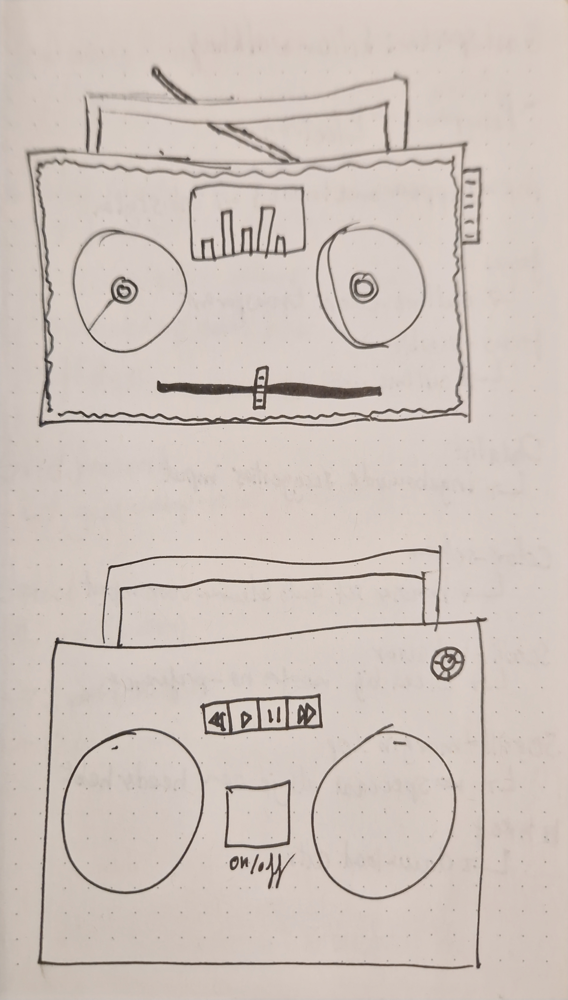

### Opbouw
Bij het opbouwen heb ik naar de [bovenstaande schetsen](#schetsen) gekeken en heb ik deze geprobeerd op te bouwen in verschillende elementen.

Zo wilde ik sections gebruiken voor verschillende vlaktes, spans voor bars, labels + radio/checkbox inputs voor interactive "buttons" en range inputs voor sliders.

Met dit in gedachte heb ik de boombox opgebouwd en dit waren de 1e resultaten:

Resultaten:
| Beschrijving | Image | Versie |
| --- | --- | --- |
| Boombox die uit staat| 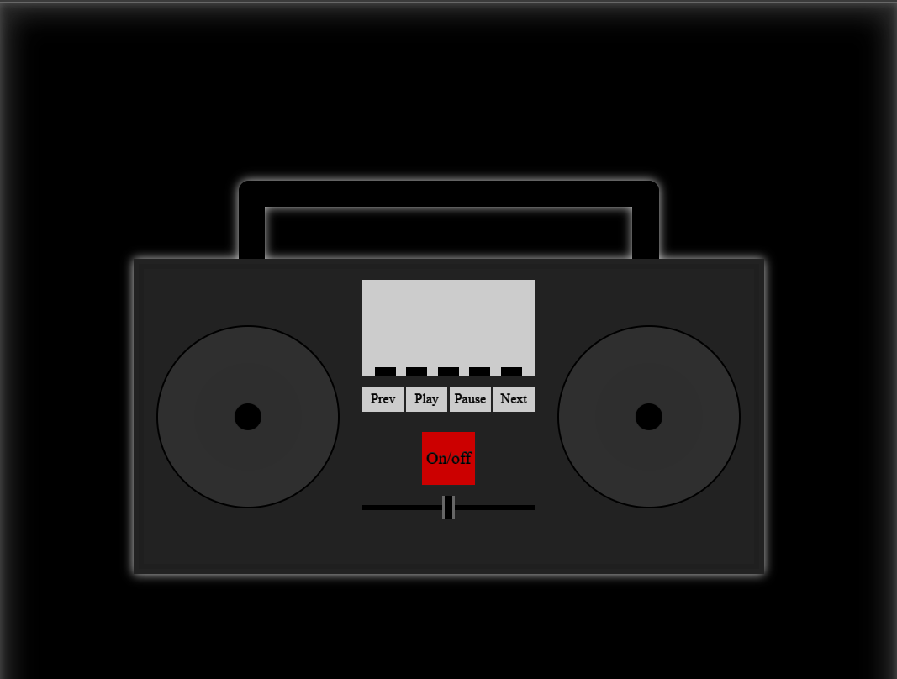 | V1 |
| Boombox die aan staat | 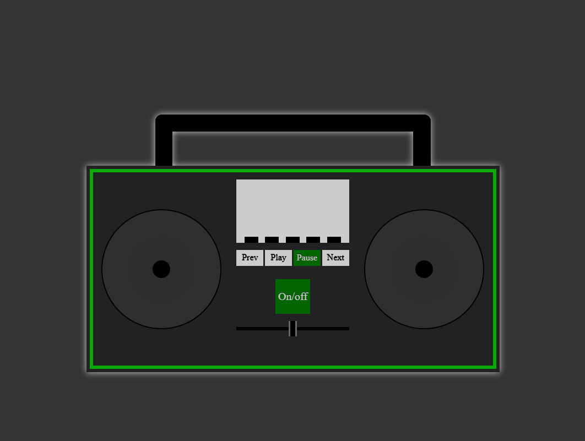 | V1 |
| Boombox in playmode 1/2 | 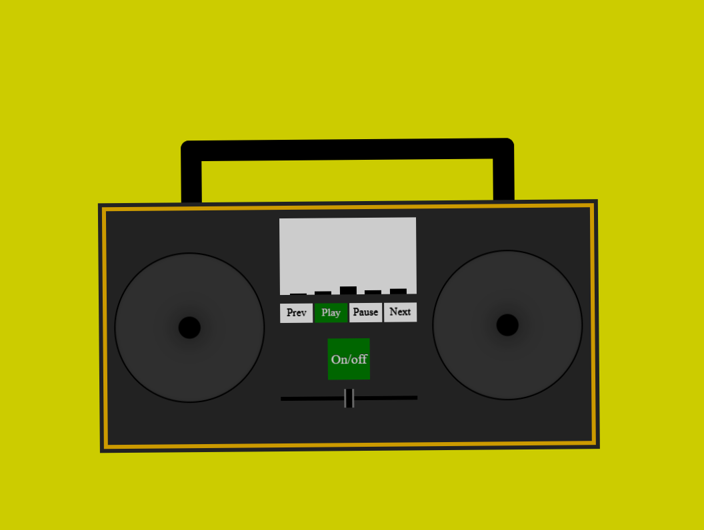 | V1 |
| Boombox in playmode 2/2 | 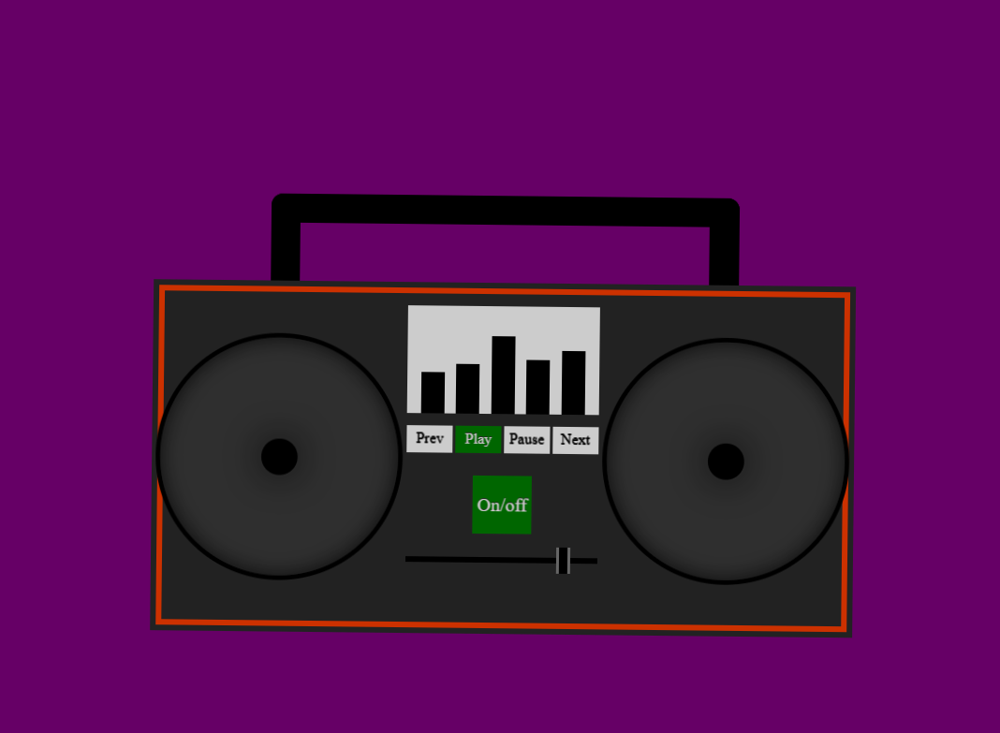 | V1 |

Dit is uiteindelijk de opbouw geworden:
- body: voor de achtergrond
- main: Om de boombox de centreren
- main > section: Als container voor de boombox
- main > section > section: Voor de handle van de boombox
- main > section > div > section: Voor de speakers
- main > section > div > div: Voor de middenstuk van de boombox
- main > section > div > div > section[aria-label="equalizer"]: Voor equalizer van de boombox
- main > section > div > div > section[aria-label="play-controls"]: Voor prev, play, pause en next buttons van de boombox
- main > section > div > div > section[aria-label="power-button"]: Voor power button van de boombox
- main > section > div > div > input[type="range"]: Voor volume slider van de boombox

### Feedback/opmerkingen

De feedback die ik had gekregen was:
- De boombox lijkt toevallig ook op een gezicht(misschien grappgig om iets daar mee te doen)
- Aan de hand van hoe hard het volumne is de verschillende elementen daar op laten reageren

### Reflectie
Deze week vond ik het redelijk goed gaan. Ik heb eigenlijk nergens struggles mee gehad. Volgende week ga ik waarschijnlijk door met meer interacties en animaties toevoegen. En ik ga kijken of ik de boombox nog wat meer details kan geven.


## Week 2: Voortgang

Deze week ben ik verder gegaan met het stylen van de boombox. Ik heb de boombox buttons meer details gegeven door er een glass effect op te zetten. Ook heb ik de speakers een inset shadow gegeven die bij de bounc animatie groter en kleiner wordt. Verder heb ik ook de background van de equalizer een backlight gegeven wanneer de power button aan is.

Resultaten:
| Beschrijving | Image | Versie |
| --- | --- | --- |
| Boombox die uit staat| 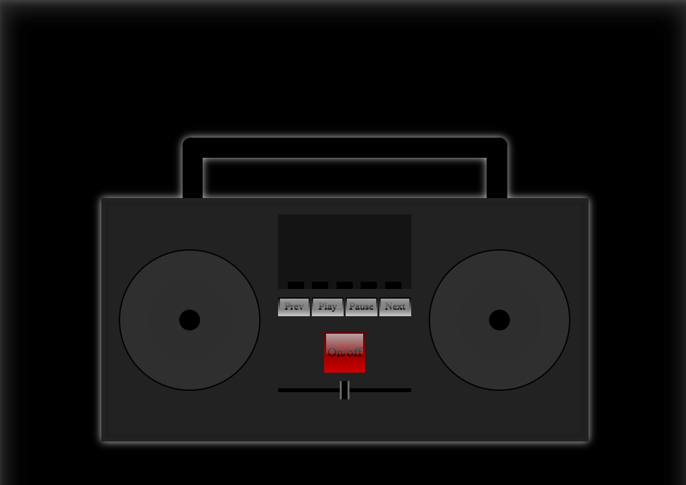 | V2 |
| Boombox die aan staat | 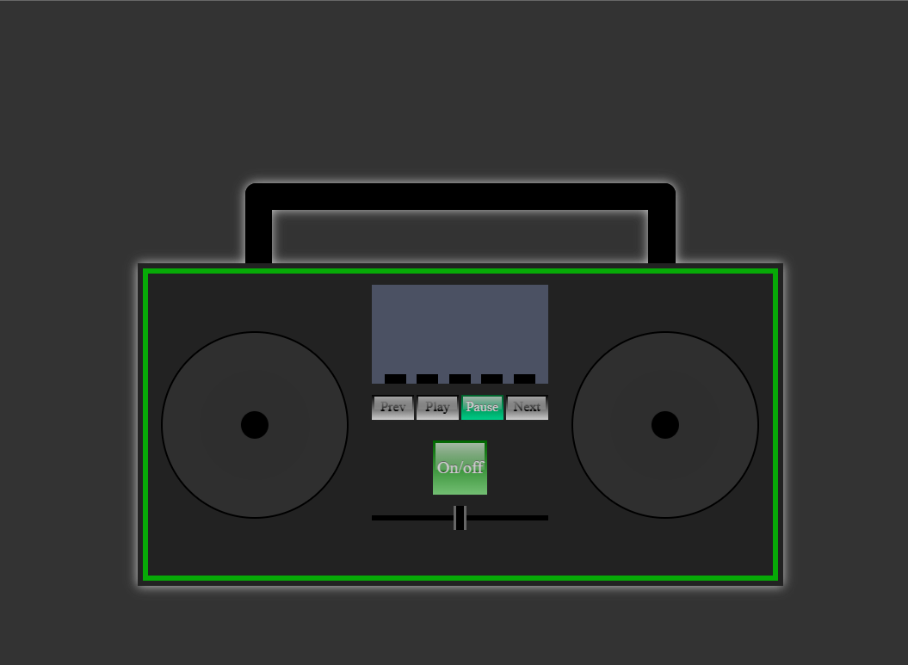 | V2 |

Na de opmerking van Sanne over hoe mijn boombox op een gezicht lijkt. Heb ik er voor gekozen om een nieuwe "mystery" modus toe te voegen. Er kan dus nu in het footer menu gekozen worden tussen boombox mode of mystery mode.

De mystery modus laat een mask op de boombox zien. En wanneer je op de play button drukt, dan schieten de ogen ook lasers in 3D. Dit heb ik gedaan door een `transform-style: preserve-3d` in combinatie met `rotate3d` te gebruiken op de ogen. En de lasers heb ik gemaakt met een ::after element.

Eerst wilde ik de lasers een vaste positie geven en dan de hele boombox laten bewegen. Hier heb ik een tijdje aan gezeten, maar dit ging niet helemaal goed.

Dit waren de resultaten daarvan.
Resultaten met rotate3d op de body:
| Resultaat | Image |
| --- | --- |
| Laserogen 1| 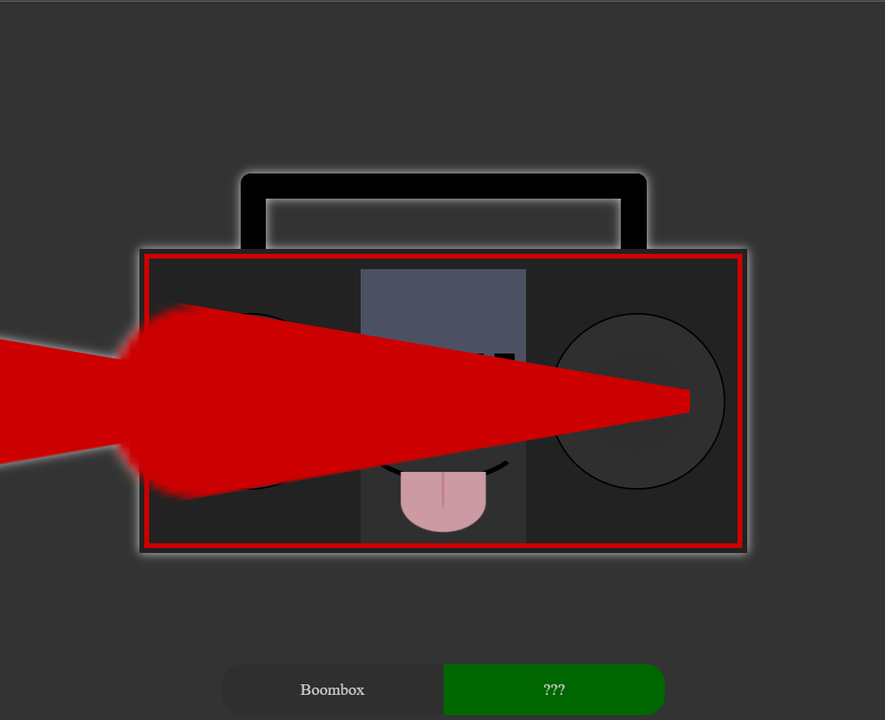 |
| Laserogen 2 angle 1 | 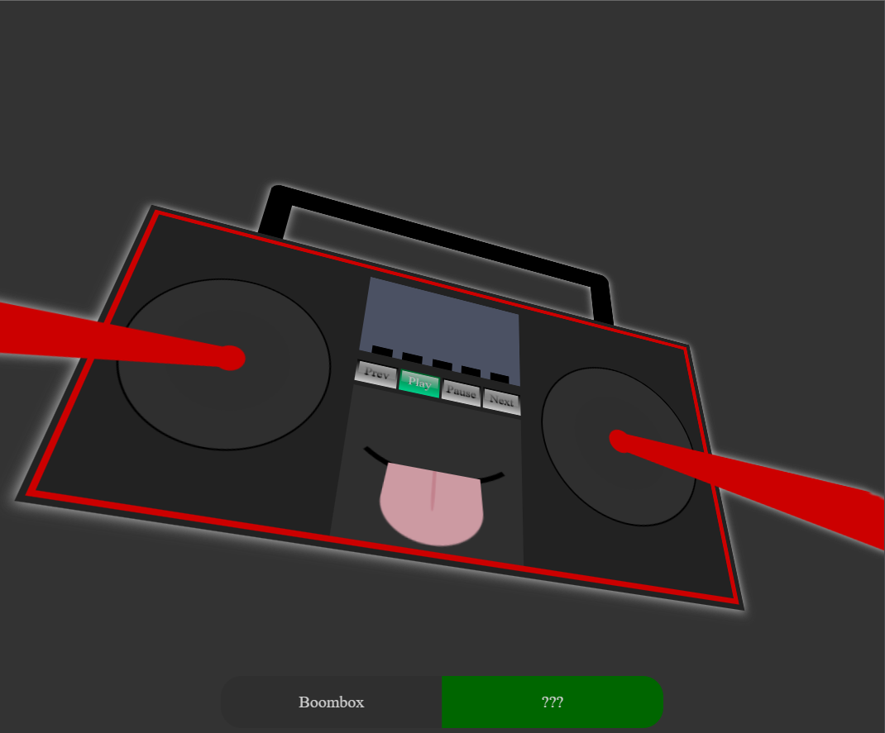 |
| Laserogen 2 angle 2 | 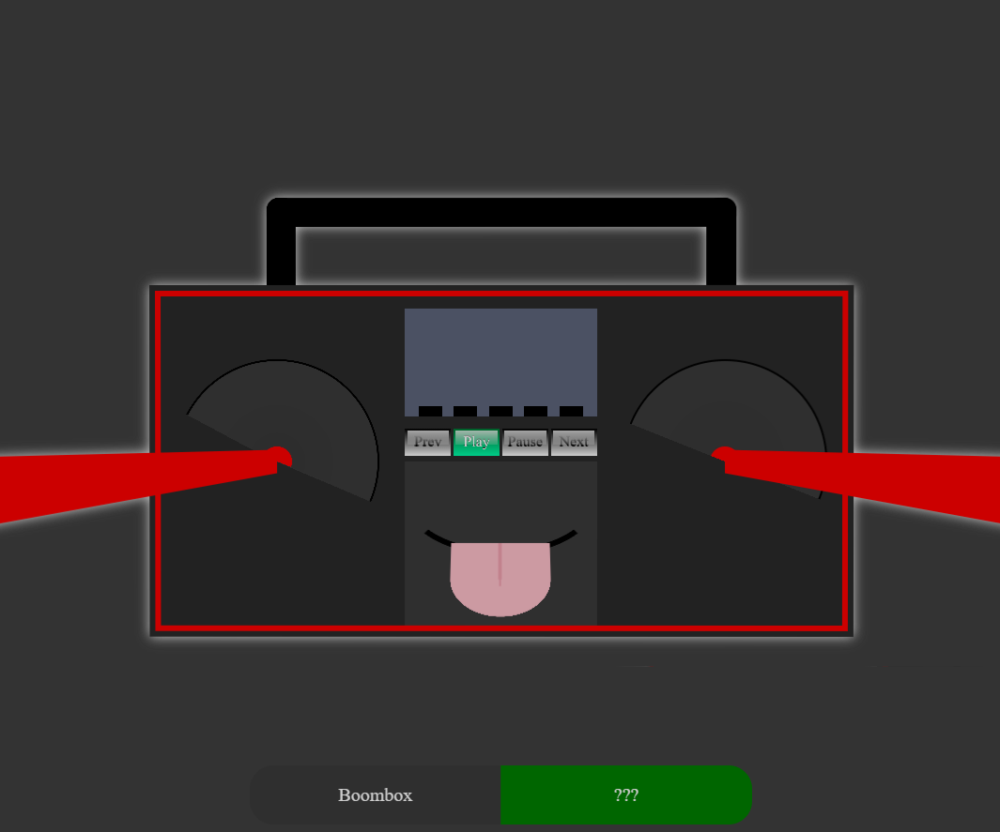 |

Ik vond het zelf een beetje een gedoe en er was steeds een bepaald element die of niet goed stond of door een ander element geclipt werd, dus heb ik uiteindelijk ervoor gekozen om de rotate3d op de ogen te zetten. de lasers hebben nog steeds een vaste positie, maar ze draaien dus mee met de ogen.

Resultaten met rotate3d op de ogen:
| Resultaat | Image |
| --- | --- |
| Angle 1| 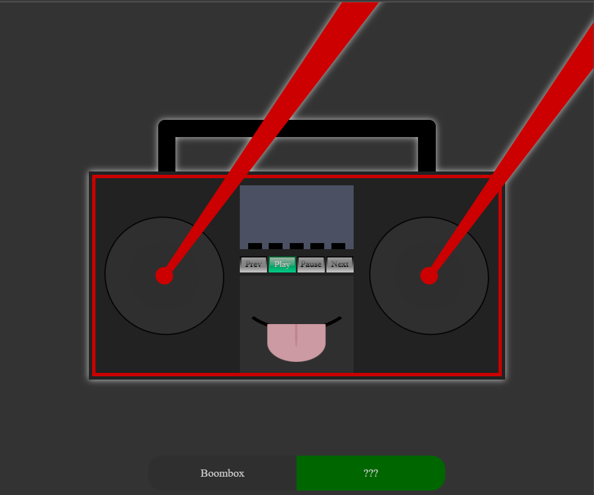 |
| Angle 2| 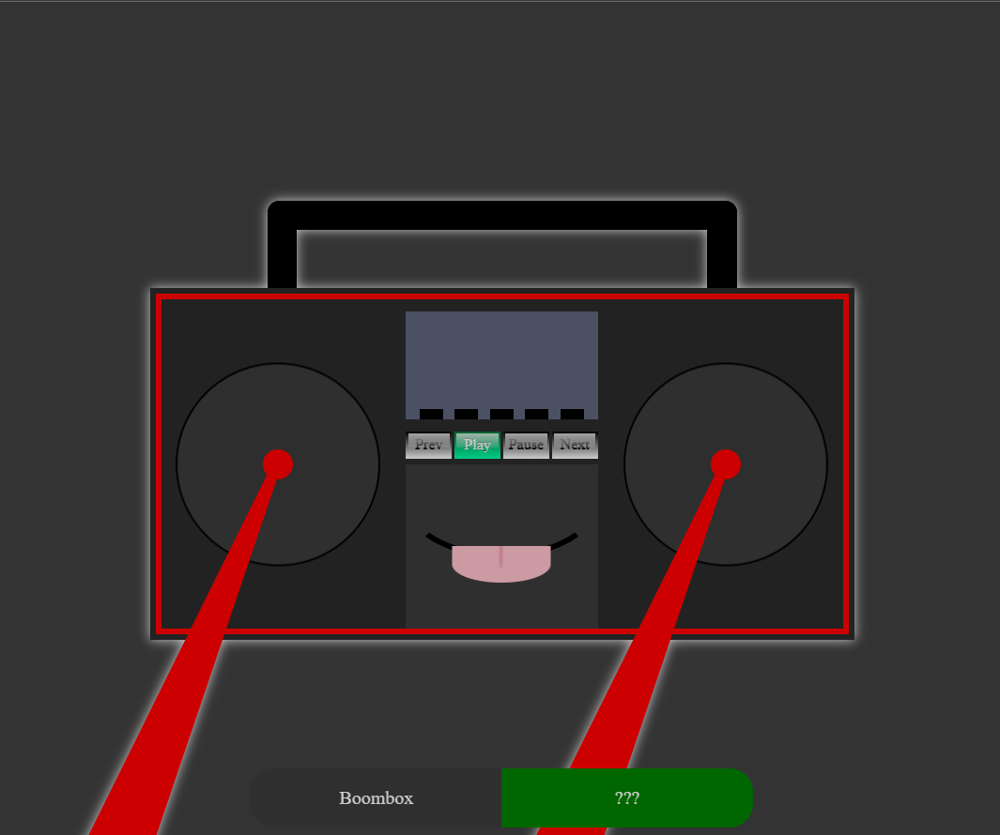 |

### Opbouw update
Door de toevoeging van de mystery modus is de opbouw van de boombox iets veranderd. Ik heb nu een extra section toegevoegd voor de mask. En heb ik in de footer een nav element toegevoegd voor de verschillende modus buttons.
- main > section > div > div > section[aria-label="mask"]: Voor de mask/mond van de boombox
- footer > <s>nav</s> menu: Voor de verschillende modus buttons


### Notes
#### Themasessie: Container queries

- Wordt vooral gebruikt om de layout van een website aan te passen aan de grootte van een container
- Gemakkelijk over te nemen in een andere pagina als component
- Hoeft niet te kijken naar andere elementen/containers

##### container

###### declareren
```css
section {
    /* 1 liner */
    container: {name} / inline-size


    /* Of apart */
    container-name: {name}
    container-type: inline-size
}
```

###### container met of zonder container name
```css
/* Alle containers */
@container {
  /* css declaraties */
}

/* Specifieke container */
@container (name) {
  /* css declaraties */
}
```

#### Extra info: Inline & Block

Inline in europa is breedte en block is hooghte, maar in bepaalde aziatische landen is het andersom.
In arabische landen en bepaalde aziatische landen switchen de start en end ook om.

##### Lang
gebruikd "dir" op de html tag om de richting van de tekst aan te geven. met de opties ltr of rtl.
Auto kijkt naar de taal die is geschreven in de html tag.

### Feedback
- Menu gebruiken voor actions
- lasers steken uit de achterkant van de speaker(ogen) op een breder scherm, kijken of dit kan worden opgelost

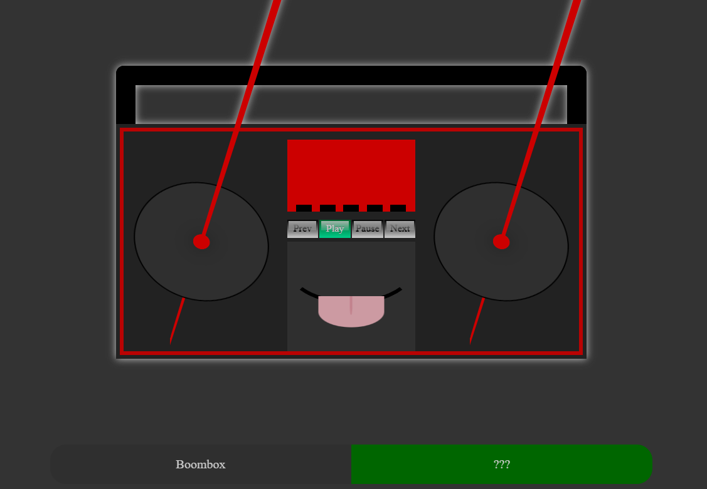


### Reflectie
Deze week vond ik het wel redelijk goed gaan, ondanks dat de lasers niet helemaal zijn gelukt volgens mijn eerste improvisatie plan, want eigenlijk had ik de lasers helemaal niet. Deze zijn er pas bijgekomen na de comments van sanne. Maar ik ben wel tevreden met het resultaat. Door te werken met de lasers in mijn mystery modus, heb ik nu ook een beter begrip van 3D omgeving en transformaties.

## Week 3

Deze week heb ik vooral gewerkt aan de punten van de feedback sessions.

Zoals de perspective van de 3d laserogen zo aangepast dat ze niet meer uit de achterkant van de boombox steken. Ik heb dit opgelost door de width van de laser dezelfde width te geven van de perspective van de parent.
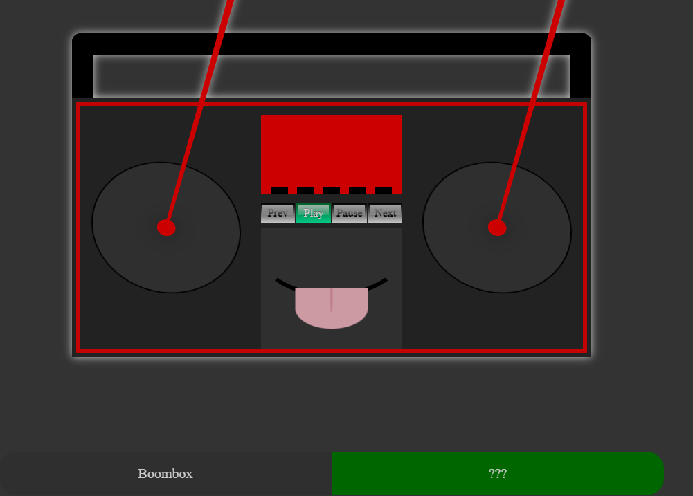

Daarnaast heb ik ook de nav van de footer veranderd naar een menu, zodat deze een betere semantiek heeft, vanwege de verschillende modus buttons.

Verder heb ik deze week niet echt meer dingen kunnen doen, omdat de rest eigenlijk wel goed verliep. Ik heb wel nog een aantal details toegevoegd aan de boombox. Zoals de speakers in mystery mode een andere kleur hebben. De speakers krijgen nu de kleur van ogen, zodat de boombox echt lijkt op een mask.

Resultaat:
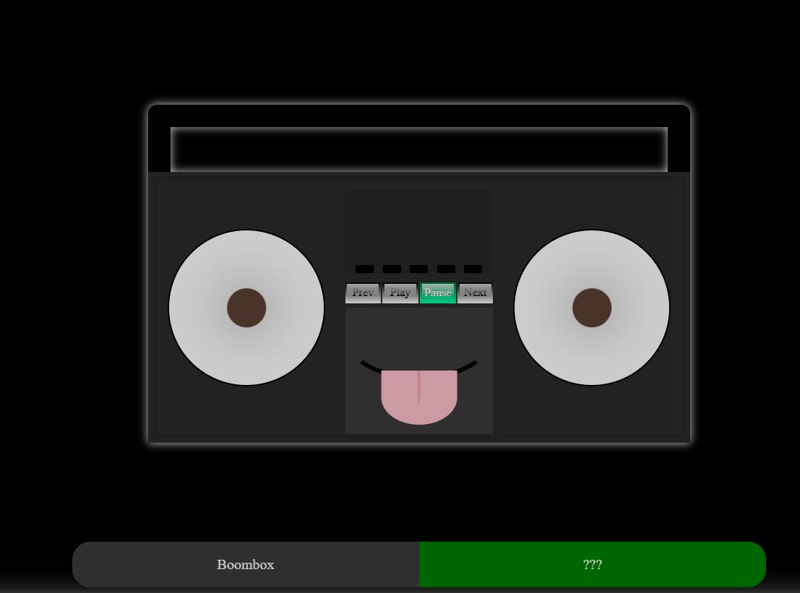

### Reflectie
Als ik terugkijk op deze opdracht, had ik het begin wel een beetje moeite om een start te maken, maar toen ik eenmaal begonnen was en wist wat ik wilde maken, ging het eigenlijk wel goed. Eigenlijk alles wat ik wilde maken van mijn originele plan is in 1 keer gelukt. Mijn improvisatie ben ik ook zeker tevreden mee en is eigenlijk zelfs hetgeen waar ik het meest trots op ben.

